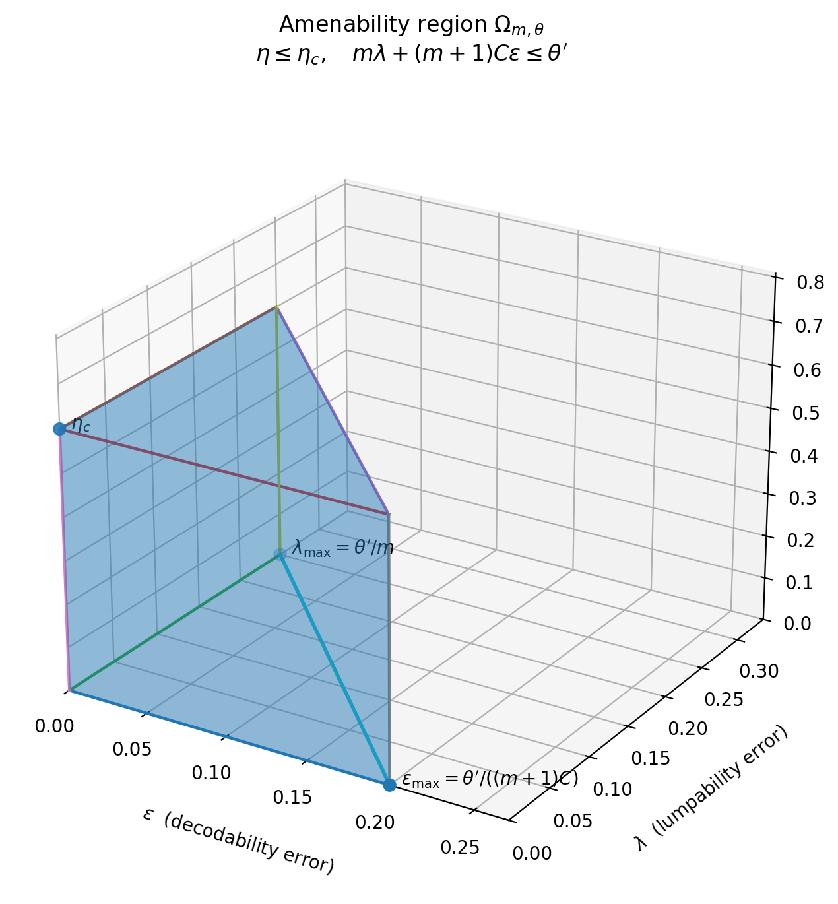
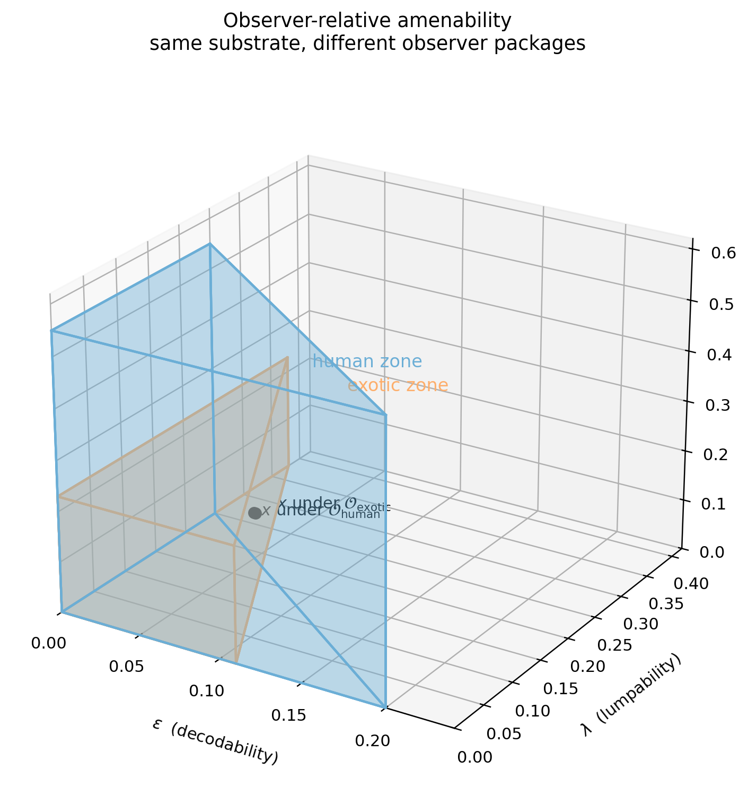

This note sits between [dissipation-and-the-emergence-of-computation.html](../dissipation-and-the-emergence-of-computation.html) and [the-geometry-of-computable-trajectories.html](../the-geometry-of-computable-trajectories.html). The first supplies the finite-horizon error budget and computation-epoch logic; the second studies the global partition of function space into the amenable set $\mathcal{A}$ and its complement $\mathcal{N}$. The present note is more local: for a fixed horizon $m$, tolerance $\theta$, and observer package, it studies the admissible region in $(\varepsilon,\eta,\lambda)$-space.

The complementary note [spectral-bandlimiting-and-compact-window-amenability.md](spectral-bandlimiting-and-compact-window-amenability.md) gives one constructive route into this local viability region by suppressing high-frequency crossings on compact windows. The efficiency note [thermodynamic-efficiency-ranking-of-computation-amenable-substrates.md](thermodynamic-efficiency-ranking-of-computation-amenable-substrates.md) then compares viable implementations thermodynamically once they are inside that region.

We work in the setting of the preceding paper. Let
$$
(\varepsilon,\eta,\lambda) \in \mathbb{R}_{\ge 0}^3
$$
denote, respectively, the decodability uncertainty, one-step instability, and lumpability defect of a coarse-grained symbolic dynamics. The computation-epoch bound from the main framework has the form
$$
m\lambda + (m+1)p_\varepsilon + \frac{\rho m(m-1)}{2} \le \theta,
$$
where $m$ is the target symbolic horizon, $p_\varepsilon$ is the decoding error induced by $H(A_n\mid R_n)\le \varepsilon$, $\rho$ is the temporal drift rate of the coarse kernels, and $\theta$ is the total variation tolerance. This suggests a natural geometry: computation occupies a bounded subregion of parameter space rather than a single yes-or-no boundary.

**Definition (Amenability region).** Fix a target horizon $m$, tolerance $\theta$, and drift rate $\rho$, and write
$$
\theta' := \theta - \frac{\rho m(m-1)}{2}.
$$
Let $\eta_c$ denote a chosen stability ceiling below which a symbolic timescale is regarded as viable. Define the **amenability region**
$$
\Omega_{m,\theta}
:=
\left\{
(\varepsilon,\eta,\lambda)\in\mathbb{R}_{\ge 0}^3
:\,
\eta\le \eta_c,\quad
m\lambda + (m+1)p_\varepsilon \le \theta'
\right\}.
$$
Thus $\Omega_{m,\theta}$ is the set of parameter triples for which readable, stable, and approximately lumpable symbolic dynamics can be sustained for at least $m$ steps within the prescribed tolerance.

**Theorem (Finite-horizon amenability criterion).** Suppose a sampled coarse-grained process satisfies:

(i) $H(A_n\mid R_n)\le \varepsilon$ for each $n$, with induced decoding error $p_\varepsilon$;

(ii) $P(A_{n+1}\neq A_n)\le \eta$ for each $n$;

(iii) approximate lumpability with defect at most $\lambda$;

(iv) temporal kernel drift at most $\rho$ over the horizon of interest.

If
$$
(\varepsilon,\eta,\lambda)\in \Omega_{m,\theta},
$$
then the decoded symbolic path is computation-amenable for $m$ steps in the sense that
$$
\bigl\|\mathcal{L}(\hat A_0,\dots,\hat A_m)-\mathcal{L}(M_0,\dots,M_m)\bigr\|_{TV}\le \theta,
$$
for a suitable time-inhomogeneous Markov chain $(M_n)$ on the coarse alphabet, and the corresponding coarse chain remains metastable with
$$
P(M_{n+1}=M_n)\ge 1-\eta.
$$

*Proof.* The Markov approximation theorem gives
$$
\bigl\|\mathcal{L}(\hat A_0,\dots,\hat A_m)-\mathcal{L}(M_0,\dots,M_m)\bigr\|_{TV}
\le m\lambda + (m+1)p_\varepsilon + \frac{\rho m(m-1)}{2}.
$$
By definition of $\Omega_{m,\theta}$, the first two terms are bounded by $\theta'$, while the drift contribution is exactly $\theta-\theta'$. Hence the total error is at most $\theta$. The metastability statement follows from one-step stability, exactly as in the main theorem. $\square$

**Proposition (Geometry of the amenability region).** For fixed $m,\theta,\rho$, the set $\Omega_{m,\theta}$ is a truncated wedge in $(\varepsilon,\eta,\lambda)$-space. Its boundary consists of the horizontal ceiling
$$
\eta = \eta_c
$$
and the budget surface
$$
m\lambda + (m+1)p_\varepsilon = \theta'.
$$
Consequently, stability acts as a hard feasibility constraint, while decodability and lumpability trade against one another through a shared finite-horizon error budget.

*Proof.* Immediate from the defining inequalities. The non-negativity constraints restrict the region to the positive octant; the inequality $\eta\le \eta_c$ clips the region by a horizontal plane; and the inequality $m\lambda+(m+1)p_\varepsilon\le \theta'$ cuts out a wedge-shaped admissible set in the $(\varepsilon,\lambda)$ directions. $\square$

In a local regime where
$$
p_\varepsilon \approx C\varepsilon
$$
for some constant $C>0$, the amenability region takes the explicit form
$$
\Omega_{m,\theta}
=
\left\{
(\varepsilon,\eta,\lambda)
:\,
\eta\le \eta_c,\quad
m\lambda + (m+1)C\varepsilon \le \theta'
\right\},
$$
whose cross-section in the $(\varepsilon,\lambda)$-plane is triangular. The full three-dimensional geometry is therefore a triangular prism clipped at height $\eta_c$.

**Corollary (Duration contracts the amenable set).** As the target horizon $m$ increases, the region $\Omega_{m,\theta}$ contracts toward the origin.

*Proof.* Increasing $m$ tightens both coefficients in the budget inequality
$$
m\lambda + (m+1)p_\varepsilon \le \theta',
$$
while $\theta'$ itself weakly decreases once drift is accounted for. Hence the admissible intercepts in the $\varepsilon$ and $\lambda$ directions shrink monotonically. $\square$

The geometric interpretation is therefore simple: short-lived computation occupies a relatively large admissible volume near the origin, while long-lived computation survives only in a thin interior region where unreadability, instability, and predictive-closure failure are all simultaneously suppressed.

{ width=78% }

*Figure 1. The basic amenability wedge. Stability imposes a hard ceiling, while decodability and lumpability consume a shared finite-horizon budget.*

## Observer-relative amenability

The preceding geometry is not purely substrate-relative. It is also observer-relative, because the observer enters through the accessible record $R_n$, the sampling interval $\Delta$, the coarse-graining $\Pi$, the decoder, and the tolerated error budget.

**Definition (Observer package).** An observer is a tuple
$$
\mathcal{O}=(R,\Delta,\Pi,\delta,\theta),
$$
where $R$ is the accessible physical record, $\Delta$ the sampling interval, $\Pi$ the coarse-graining map, $\delta$ the decoder, and $\theta$ the tolerated path-space error. The observer-induced amenability coordinates are
$$
\Xi(\mathcal{O})=(\varepsilon_{\mathcal O},\eta_{\mathcal O},\lambda_{\mathcal O}).
$$

**Definition (Observer-indexed amenability region).** For a fixed observer package $\mathcal O$, define
$$
\Omega^{(\mathcal O)}_{m,\theta}
:=
\left\{
(\varepsilon,\eta,\lambda)\in\mathbb R_{\ge 0}^3:
\eta\le \eta_c^{(\mathcal O)},\quad
m\lambda + (m+1)p^{(\mathcal O)}_\varepsilon \le \theta_{\mathcal O}'
\right\},
$$
where
$$
\theta_{\mathcal O}' := \theta_{\mathcal O} - \frac{\rho_{\mathcal O}m(m-1)}{2}.
$$
Different observers therefore induce different admissible solids in the same positive-octant parameter space.

**Definition (Observer transformation).** Let
$$
T=(g_R,\alpha,\Phi_\Pi,g_\delta,g_\theta)
$$
be an observer transformation, where $g_R$ changes the accessible record, $\alpha>0$ rescales the sampling interval, $\Phi_\Pi$ changes the coarse-graining, $g_\delta$ changes the decoder, and $g_\theta$ changes the tolerated budget. Then
$$
T:\mathcal O \mapsto \mathcal O'=(g_R(R),\alpha\Delta,\Phi_\Pi(\Pi),g_\delta(\delta),g_\theta(\theta)).
$$
The exact transformed coordinates are those induced by the new observer package:
$$
\varepsilon_{\mathcal O'} := H(A_n^{\mathcal O'}\mid R_n^{\mathcal O'}),
$$
$$
\eta_{\mathcal O'} := P(A_{n+1}^{\mathcal O'}\neq A_n^{\mathcal O'}),
$$
$$
\lambda_{\mathcal O'} := \sup_{x,y:\,\Pi'(x)=\Pi'(y)}
\left\|
\mathcal L(A_{n+1}^{\mathcal O'}\mid X_n=x)-\mathcal L(A_{n+1}^{\mathcal O'}\mid X_n=y)
\right\|_{TV}.
$$

**Proposition (Local observer transformation law).** Suppose the coarse-graining is fixed, the sampled microdynamics form a semigroup $P_\Delta=e^{\Delta Q}$, and coarse symbol flips are locally generated by a hazard rate $\kappa$. Under a pure time-rescaling $\Delta' = \alpha\Delta$ and a record map $g_R$,
$$
\eta' \approx 1-(1-\eta)^\alpha,
$$
$$
\lambda' = \alpha\lambda + O(\Delta^2),
$$
and any record-degrading channel satisfies
$$
\varepsilon' \ge \varepsilon.
$$
In the small-$\Delta$ regime this reduces to the first-order law
$$
(\varepsilon,\eta,\lambda)
\mapsto
(\varepsilon_g,\alpha\eta,\alpha\lambda),
$$
with $\varepsilon_g\ge \varepsilon$.

*Proof.* If symbol flips are Poisson-like with hazard $\kappa$, then
$$
\eta(\Delta)=1-e^{-\kappa\Delta},
$$
so under $\Delta' = \alpha\Delta$ we obtain
$$
\eta' = 1-e^{-\kappa\alpha\Delta}=1-(1-\eta)^\alpha.
$$
For lumpability, the semigroup expansion $P_\Delta=I+\Delta Q+O(\Delta^2)$ implies that the one-step defect scales linearly in $\Delta$, hence $\lambda'=\alpha\lambda+O(\Delta^2)$. Finally, if $g_R$ discards information, the data-processing inequality implies that the conditional uncertainty cannot decrease, so $\varepsilon'\ge \varepsilon$. $\square$

**Corollary (Observer relativity of amenability).** Let $\mathcal O$ and $\mathcal O'$ be two observers related by an observer transformation. Then, in general,
$$
\Omega^{(\mathcal O)}_{m,\theta} \neq \Omega^{(\mathcal O')}_{m,\theta}.
$$
The same substrate may therefore be computation-amenable for one observer and non-amenable for another, not because the substrate changed, but because the observer package changed.

*Proof.* The preceding proposition shows that changes in record quality, sampling scale, and coarse-graining generically change the induced coordinates $(\varepsilon,\eta,\lambda)$ and therefore deform the defining inequalities of the amenability region. $\square$

This gives a simple picture. A human observer is naturally biased toward mesoscopic, slow, high-dwell symbolic structure. An exotic observer living on very different timescales, or with access to a very different physical record, may induce a markedly different admissible zone. The result is not a vague relativism. It is a controlled geometry of observer-dependent computational viability.

{ width=82% }

*Figure 2. Two observer-relative amenability zones for the same substrate. The black arrow indicates that changing the observer package can move the same underlying process to a different point in $(\varepsilon,\eta,\lambda)$-space.*

## Mild SETI corollary

One possible implication for the search for extraterrestrial intelligence is methodological rather than dramatic. If detectability depends in part on the observer package, then the search for artificial or life-bearing signals may be complicated by the geometry developed above. A nonhuman intelligence could occupy a symbolic regime that is too fast, too slow, too finely partitioned, or too differently recorded to fall inside the amenability zone induced by familiar human-scale choices of sampling, coarse-graining, and decoding.

The natural lesson is therefore modest: in addition to scanning over candidate signals, one may also need to scan over observer transformations. On this view, some failures of detection need not indicate the absence of structure, but a mismatch between the searched-for observer geometry and the geometry under which the signal would become computationally legible.

This local parameter-space picture is not a replacement for the repo's global geometry paper. It is the finite-horizon slice through that larger landscape: the global paper asks where $\mathcal{A}$ sits inside trajectory space, while this note asks how a fixed observer and tolerance carve out a viable operating zone once a trajectory has been proposed.
